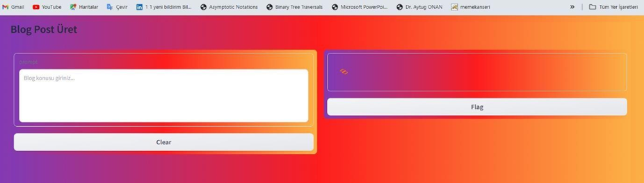
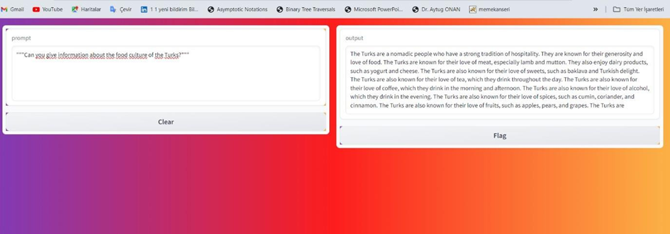
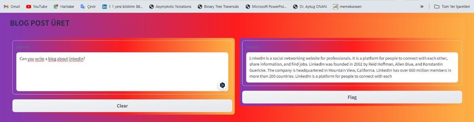
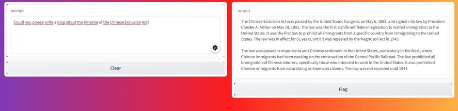

# 📘 NLP Term Project - Text Generation with Large Language Models

This project explores **Natural Language Processing (NLP)** and **text generation** using cutting-edge large language models. The objective is to generate consistent, context-sensitive, and high-quality text based on user inputs by fine-tuning pre-trained models. The project is implemented using **Hugging Face Transformers**, **PEFT techniques**, and **Quantization** to optimize model performance and resource usage.

---

## 🎯 Project Goals

- Explore the capabilities of **Mistral-7B** (a large language model).
- Fine-tune the model using **LoRA (Low-Rank Adaptation)** for efficient training.
- Implement **Quantization** to reduce memory and computation requirements.
- Generate text that is coherent, relevant, and aligned with the provided input prompts.

---

## 🛠️ Methodology

### 1. **Data Preparation**
- Used **Databricks Dolly-15k Dataset** containing 15,000 text samples.
- Preprocessed the dataset using:
  - **Tokenization**: Converted text into tokens using `AutoTokenizer`.
  - **Prompt Engineering**: Designed custom prompts for effective training and evaluation.

### 2. **Model Training**
- Loaded **Mistral-7B** pre-trained model.
- Applied **LoRA** technique for fine-tuning:
  - Froze most model weights to reduce training time and cost.
  - Trained a small subset of weights specific to the task.
- Used **SFTTrainer** for training, optimizing parameters with gradient checkpointing.

### 3. **Quantization**
- Reduced model size using **BitsAndBytesConfig** to:
  - Enable training on systems with limited memory.
  - Load weights in 4-bit precision.

### 4. **Evaluation and Deployment**
- Evaluated the model's performance using custom prompts.
- Deployed the fine-tuned model on Hugging Face Hub for inference.

---

## 🧩 Features

- **Efficient Training**:
  - LoRA and Quantization techniques minimize computational overhead.
- **High-Quality Text Generation**:
  - Produces contextually accurate text using advanced prompt designs.
- **Modular Pipeline**:
  - Supports seamless integration of various pre-processing and post-processing steps.
- **Interactive Interface**:
  - Built with **Gradio** for user-friendly interaction and visualization.

---

## 🖥️ Screenshots

### Tokenization and Model Loading



### Model Output Example
!


---

## 🔧 Technologies Used

- **Programming Language**: Python
- **Frameworks & Libraries**:
  - Hugging Face Transformers
  - PEFT
  - Gradio
  - Pandas
  - PyTorch
- **Dataset**: Databricks Dolly-15k
- **Model**: Mistral-7B

---

## 🚀 Installation & Setup

1. **Clone the Repository**:
   ```bash
   git clone https://github.com/<your-repo-name>/NLP-TextGeneration.git
   cd NLP-TextGeneration
